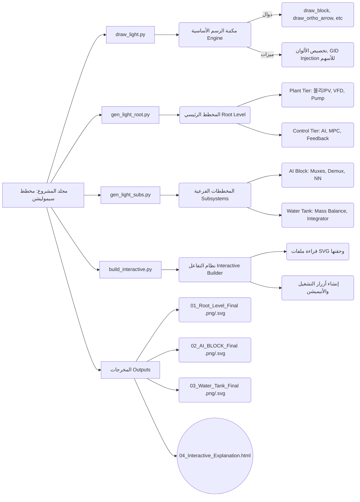
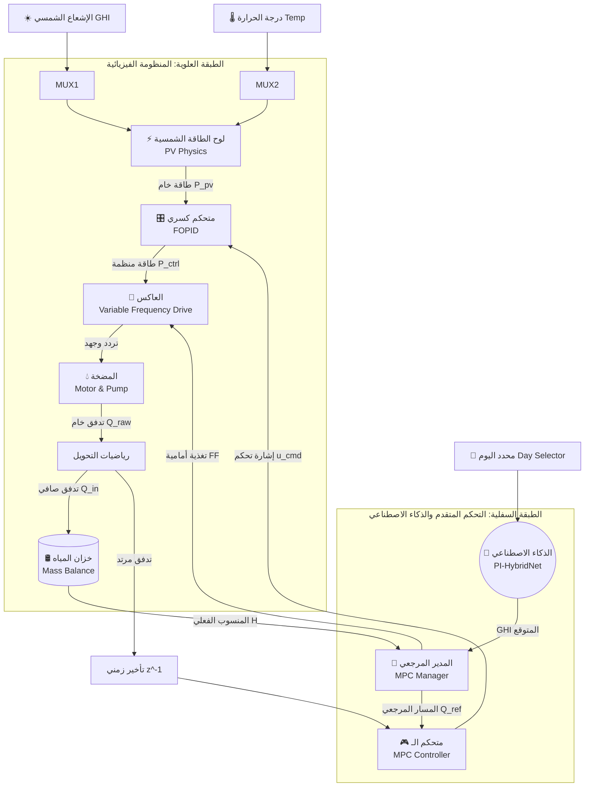

# Hybrid AI-MPC Simulink Reconstruction
**شجرة وهيكلية المشروع الشاملة**

تمثل هذه الوثيقة الهيكلة المعمارية الكاملة للمشروع الذي قمنا بتحليله وبنائه معاً. المشروع ينقسم إلى مسارين رئيسيين: 
1. **الجانب الأكاديمي/الفيزيائي:** محاكاة عمل محطة طاقة شمسية هجينة مع خزان مياه.
2. **الجانب البرمجي (Python/Web):** الأكواد التي قمنا بكتابتها لتحويل هذه المخططات إلى رسومات SVG تفاعلية (Interactive Web App).

---

## 1. شجرة الأكواد والملفات (Code Directory Tree)
هذه الشجرة توضح وظيفة كل ملف قمنا بكتابته في مجلد المشروع `مخطط سيموليشن`:

---

## 2. الهيكلة الهندسية للمحاكاة (System Architecture Flow)
هذا المخطط يشرح التدفق الميكانيكي والكهربائي للمحاكاة (كيف تعمل المنظومة داخلياً):

---

## 3. آلية عمل الواجهة التفاعلية (Interactive Logic)
كيف تعمل صفحة الـ HTML التي تراها في المتصفح؟

1. **الترابط (Binding):** عند رسم المخطط في بايثون، نعطي كل سلك وكل بلوك اسماً برمجياً (مثلاً `gid='block_pv'` أو `gid='path_in_1'`).
2. **التحويل (Translation):** تقوم بايثون بتحويل الرسمة إلى كود رسومي SVG. الـ SVG يحتفظ بالأسماء البرمجية.
3. **الحقن (Injection):** يقوم `build_interactive.py` بأخذ الـ SVG ولصقه مباشرة داخل ملف الـ HTML.
4. **التفاعل (Interactivity):**
   - **النقر:** الجافاسكريبت تبحث عن العناصر المطابقة في القاموس، وعند النقر تستبدل النص الجانبي بالشرح الأكاديمي.
   - **الأنيميشن:** عند الضغط على زر التشغيل، يضيف الجافاسكريبت كلاس CSS اسمه `flowing-path` للأسلاك بترتيب زمني (Timeouts)، مما يجعل السلك يضيء كأنه تيار حقيقي يتدفق.

---
> [!TIP]
> **تم حل مشكلة التداخل:**
> لقد لاحظت وجود بلوكات ثابتة (GHI و Temp) موضوعة تماماً فوق MUX 1 و MUX 2 في المخطط الرئيسي (Root). تم حذف البلوكات الزائدة المتداخلة وتنظيف بداية المخطط بنجاح ليكون انسيابياً تماماً!
