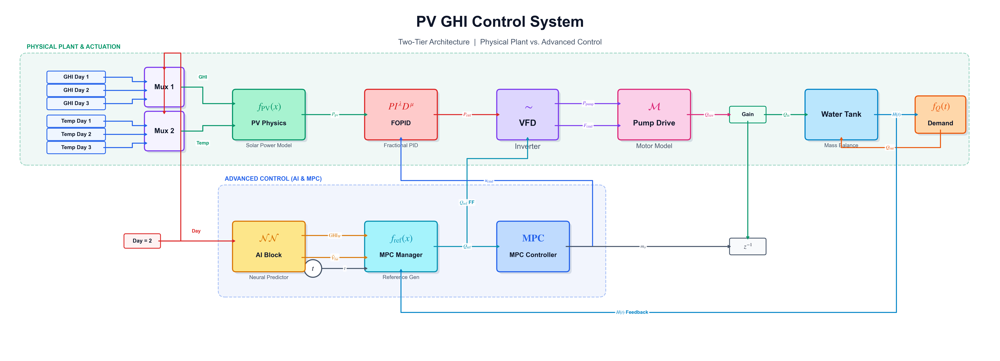

  

  # ⚡ Simulink Hybrid AI-MPC Control Diagram Reconstructor

  **A Professional Publication-Ready Diagram Generator & Interactive Offline Simulation Tracker.**

  

---

## 🎯 Overview

This project programmatically transforms complex raw Simulink systems into **IEEE Publication-Ready** high-fidelity SVG/PNG graphics using Python's `matplotlib`. It organizes chaotic plant and control logic into a strict **Two-Tier Architecture** (Physical Plant vs. Control & AI).

Beyond static rendering, the project generates a **Zero-Dependency Interactive HTML Interface** that allows users to:
1. **Explore:** Click on any physical or logical block to view detailed Arabic academic explanations.
2. **Simulate:** Run an **Auto-Tracking Animated Simulation** that visually traces energy and signal flow across wires and components using glowing CSS animations and smooth camera panning.

## ✨ Features

- **High-Fidelity Rendering:** Generates 300 DPI graphics with precise LaTeX (`MathText`) formatting, orthogonal signal routing, and academic standard color palettes.
- **Standalone Interactive UI:** Embeds SVGs directly into a single `HTML` file—no servers, no external dependencies, bypassing CORS completely.
- **Signal Flow Simulation:** Implements a multi-phase animated signal tracker. Wires glow and "flow" using `stroke-dasharray` while an auto-panning camera follows the action step-by-step.
- **Manual Pan & Zoom:** Native, lightweight JavaScript implementation allowing users to freely drag and scroll-to-zoom across the diagrams.

## 🏗️ Architecture

You can view the comprehensive project architecture and codebase structure in the documentation:
👉 [**Project Architecture Tree (Mermaid)**](Project_Architecture_Tree.md)

## 📂 Included Diagrams

1. **Root Level Diagram:** The main integration of the physical water tank plant and the predictive controller.
2. **AI Predictor Subsystem:** The inner mechanics of the Neural Network (PI-HybridNet) and multiplexer logic.
3. **Water Tank Subsystem:** The physical mass-balance equations, integrators, and saturation bounds.

---
*Generated and architected via Advanced Agentic AI Coding.*
